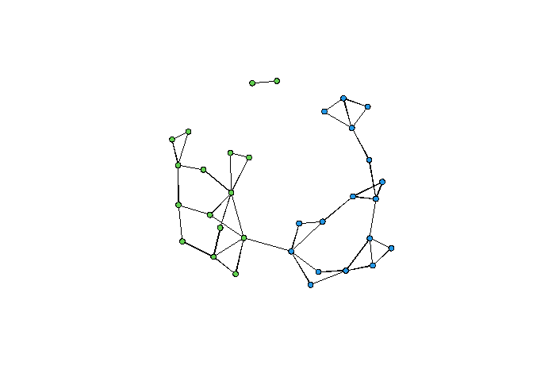

Douglas Luke\_Ch 2 Users Guide to Network Analysis in R
================
MM
10/05/2021

\#\#Network Analysis Fundamentals - Pt.1

``` r
#if below is needed, please Remove Commenting
## install.packages("devtools")
# devtools::install_github("DougLuke/UserNetR")
```

    ## Loading required package: tergm

    ## Loading required package: ergm

    ## Loading required package: network

    ## network: Classes for Relational Data
    ## Version 1.16.1 created on 2020-10-06.
    ## copyright (c) 2005, Carter T. Butts, University of California-Irvine
    ##                     Mark S. Handcock, University of California -- Los Angeles
    ##                     David R. Hunter, Penn State University
    ##                     Martina Morris, University of Washington
    ##                     Skye Bender-deMoll, University of Washington
    ##  For citation information, type citation("network").
    ##  Type help("network-package") to get started.

    ## 
    ## ergm: version 3.11.0, created on 2020-10-14
    ## Copyright (c) 2020, Mark S. Handcock, University of California -- Los Angeles
    ##                     David R. Hunter, Penn State University
    ##                     Carter T. Butts, University of California -- Irvine
    ##                     Steven M. Goodreau, University of Washington
    ##                     Pavel N. Krivitsky, UNSW Sydney
    ##                     Martina Morris, University of Washington
    ##                     with contributions from
    ##                     Li Wang
    ##                     Kirk Li, University of Washington
    ##                     Skye Bender-deMoll, University of Washington
    ##                     Chad Klumb
    ##                     Michal Bojanowski, Kozminski University
    ##                     Ben Bolker
    ## Based on "statnet" project software (statnet.org).
    ## For license and citation information see statnet.org/attribution
    ## or type citation("ergm").

    ## NOTE: Versions before 3.6.1 had a bug in the implementation of the bd()
    ## constraint which distorted the sampled distribution somewhat. In
    ## addition, Sampson's Monks datasets had mislabeled vertices. See the
    ## NEWS and the documentation for more details.

    ## NOTE: Some common term arguments pertaining to vertex attribute and
    ## level selection have changed in 3.10.0. See terms help for more
    ## details. Use 'options(ergm.term=list(version="3.9.4"))' to use old
    ## behavior.

    ## Loading required package: networkDynamic

    ## 
    ## networkDynamic: version 0.10.1, created on 2020-01-16
    ## Copyright (c) 2020, Carter T. Butts, University of California -- Irvine
    ##                     Ayn Leslie-Cook, University of Washington
    ##                     Pavel N. Krivitsky, University of Wollongong
    ##                     Skye Bender-deMoll, University of Washington
    ##                     with contributions from
    ##                     Zack Almquist, University of California -- Irvine
    ##                     David R. Hunter, Penn State University
    ##                     Li Wang
    ##                     Kirk Li, University of Washington
    ##                     Steven M. Goodreau, University of Washington
    ##                     Jeffrey Horner
    ##                     Martina Morris, University of Washington
    ## Based on "statnet" project software (statnet.org).
    ## For license and citation information see statnet.org/attribution
    ## or type citation("networkDynamic").

    ## 
    ## tergm: version 3.7.0, created on 2020-10-15
    ## Copyright (c) 2020, Pavel N. Krivitsky, UNSW Sydney
    ##                     Mark S. Handcock, University of California -- Los Angeles
    ##                     with contributions from
    ##                     David R. Hunter, Penn State University
    ##                     Steven M. Goodreau, University of Washington
    ##                     Martina Morris, University of Washington
    ##                     Nicole Bohme Carnegie, New York University
    ##                     Carter T. Butts, University of California -- Irvine
    ##                     Ayn Leslie-Cook, University of Washington
    ##                     Skye Bender-deMoll
    ##                     Li Wang
    ##                     Kirk Li, University of Washington
    ##                     Chad Klumb
    ## Based on "statnet" project software (statnet.org).
    ## For license and citation information see statnet.org/attribution
    ## or type citation("tergm").

    ## Loading required package: ergm.count

    ## 
    ## ergm.count: version 3.4.0, created on 2019-05-15
    ## Copyright (c) 2019, Pavel N. Krivitsky, University of Wollongong
    ##                     with contributions from
    ##                     Mark S. Handcock, University of California -- Los Angeles
    ##                     David R. Hunter, Penn State University
    ## Based on "statnet" project software (statnet.org).
    ## For license and citation information see statnet.org/attribution
    ## or type citation("ergm.count").

    ## NOTE: The form of the term 'CMP' has been changed in version 3.2 of
    ## 'ergm.count'. See the news or help('CMP') for more information.

    ## Loading required package: sna

    ## Loading required package: statnet.common

    ## 
    ## Attaching package: 'statnet.common'

    ## The following object is masked from 'package:base':
    ## 
    ##     order

    ## sna: Tools for Social Network Analysis
    ## Version 2.6 created on 2020-10-5.
    ## copyright (c) 2005, Carter T. Butts, University of California-Irvine
    ##  For citation information, type citation("sna").
    ##  Type help(package="sna") to get started.

    ## Loading required package: tsna

    ## 
    ## statnet: version 2019.6, created on 2019-06-13
    ## Copyright (c) 2019, Mark S. Handcock, University of California -- Los Angeles
    ##                     David R. Hunter, Penn State University
    ##                     Carter T. Butts, University of California -- Irvine
    ##                     Steven M. Goodreau, University of Washington
    ##                     Pavel N. Krivitsky, University of Wollongong
    ##                     Skye Bender-deMoll
    ##                     Martina Morris, University of Washington
    ## Based on "statnet" project software (statnet.org).
    ## For license and citation information see statnet.org/attribution
    ## or type citation("statnet").

    ## unable to reach CRAN

### First Plot of the network

``` r
gender <- Moreno %v% "gender"

plot(Moreno, vertex.col = gender + 2, vertex.cex = 1.2)
```

<!-- -->

### Network Size

``` r
# We can find a whole range of info in the summary
summary(Moreno, print.adj=FALSE)
```

    ## Network attributes:
    ##   vertices = 33
    ##   directed = FALSE
    ##   hyper = FALSE
    ##   loops = FALSE
    ##   multiple = FALSE
    ##   bipartite = FALSE
    ##  total edges = 46 
    ##    missing edges = 0 
    ##    non-missing edges = 46 
    ##  density = 0.08712121 
    ## 
    ## Vertex attributes:
    ## 
    ##  gender:
    ##    numeric valued attribute
    ##    attribute summary:
    ##    Min. 1st Qu.  Median    Mean 3rd Qu.    Max. 
    ##   1.000   1.000   2.000   1.515   2.000   2.000 
    ##   vertex.names:
    ##    character valued attribute
    ##    33 valid vertex names
    ## 
    ## No edge attributes

``` r
# BUT if we are only looking for network size...
network.size(Moreno)
```

    ## [1] 33

### Density

``` r
# 46 is the number of observed ties (L)
densityByHand <-  2 * 46 / (33*(33 - 1))
densityByHand
```

    ## [1] 0.08712121

``` r
# same result with gden() - function

gden(Moreno)
```

    ## [1] 0.08712121

Note that the `echo = FALSE` parameter was added to the code chunk to
prevent printing of the R code that generated the plot.
